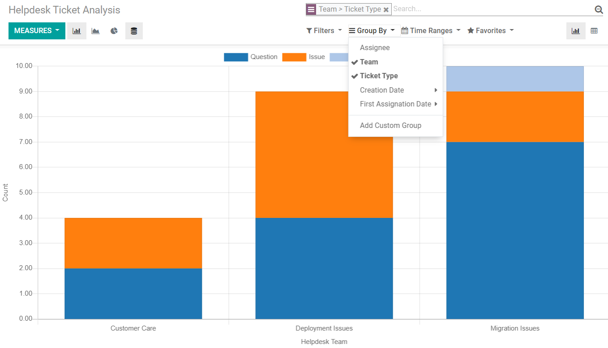
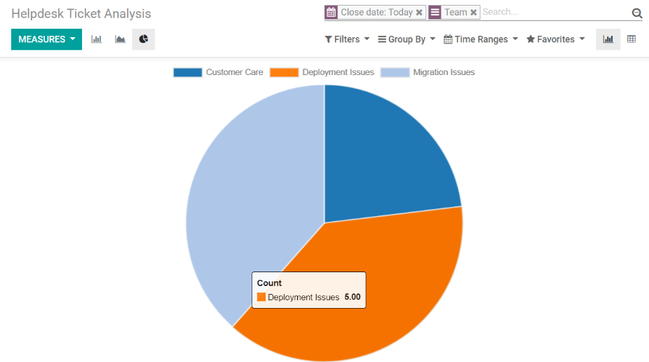
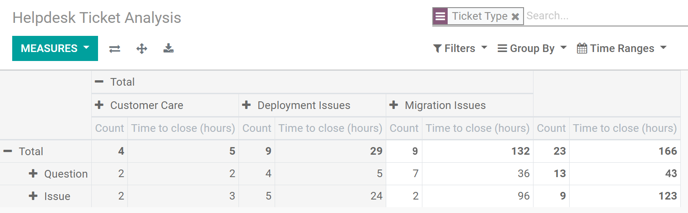
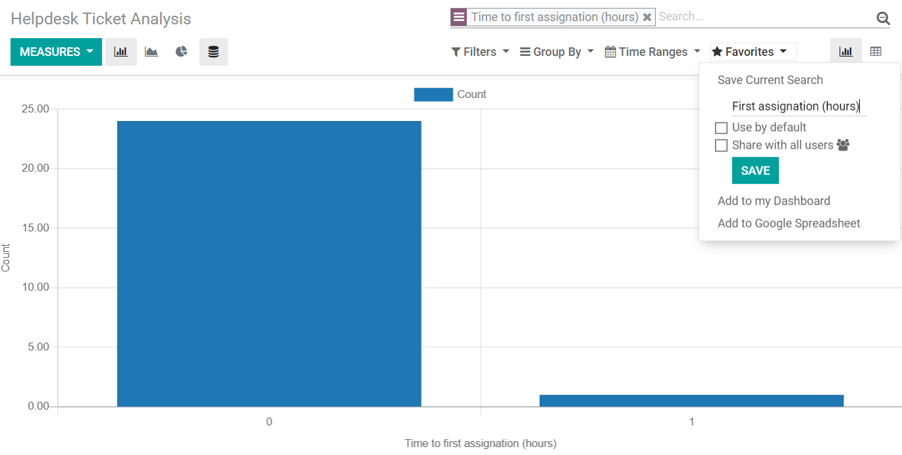

============================
Reports for a Better Support
============================

An efficient customer service solution also has a built-in reporting option. Reports allow you to
track trends, identify areas for improvement, manage employees’ workloads, and most importantly,
meet your customer’s expectations.

Cases
~~~~~

Some examples of the possible reports Odoo Helpdesk can generate include:

- The number of tickets *grouped by* team and ticket type.

| In this manner, you are able to evaluate which ticket types have been the most frequent ones,
  plus the workload of your teams.
| Apply *Time Ranges* if you would like to make comparisons to a *Previous Period* or a *Previous
  Year*.

- The number of tickets closed per day, per team.

Get an overview of how many requests each support team is closing per day in order to measure
their performance, and identify productivity levels to understand how many requests they are
able to handle.

.. tip::
   Filter it by *Assignee* to see the KPI by agent.

- The number of hours tickets are taking to be solved, grouped by team and ticket type.

Check if your expectations are being met by *measuring* the *Time to close (hours)*. Your
customers not only expect fast responses but they also want their issues handled quickly.

         Odoo Helpdesk

Save filters
~~~~~~~~~~~~

Save the filters you use the most and save time not having to construct them every time they are
needed. To do so, set the groups, filters and measures needed, then go to *Favorites*.

         in Odoo Helpdesk

.. seealso::
   - :doc:`receiving_tickets`
   - :doc:`sla`
